

# Image_Segmentation_Femur_Bone

The objective of this project was to segment the femur bone from radiographic images. Initially, there was insufficient data available to employ machine learning techniques. Consequently, we endeavored to design an algorithm to detect the femur bone's edges within its entire surrounding environment using only a few sample images. Subsequently, we gained access to a larger dataset and proceeded to train a machine learning model.

---

**Classic Method**

In this method, femur extraction was performed in three stages:
1. Detecting the circle
2. Identifying the femur shaft
3. Locating the femoral neck and trochanters

First, using a neural network, we cropped the region containing the femur from the entire image. Then, we cropped the area containing the femoral head using a U-Net model. A total of 570 labeled images were used for training.

The U-Net model used in this step resized the images to 512x512 pixels, which distorted the original aspect ratio and made it harder to detect circular shapes in the femur. To avoid this issue, we first added black padding to the image edges to make them square. This approach preserved the aspect ratio during resizing, simplifying circle detection. The output of this network was as follows.

  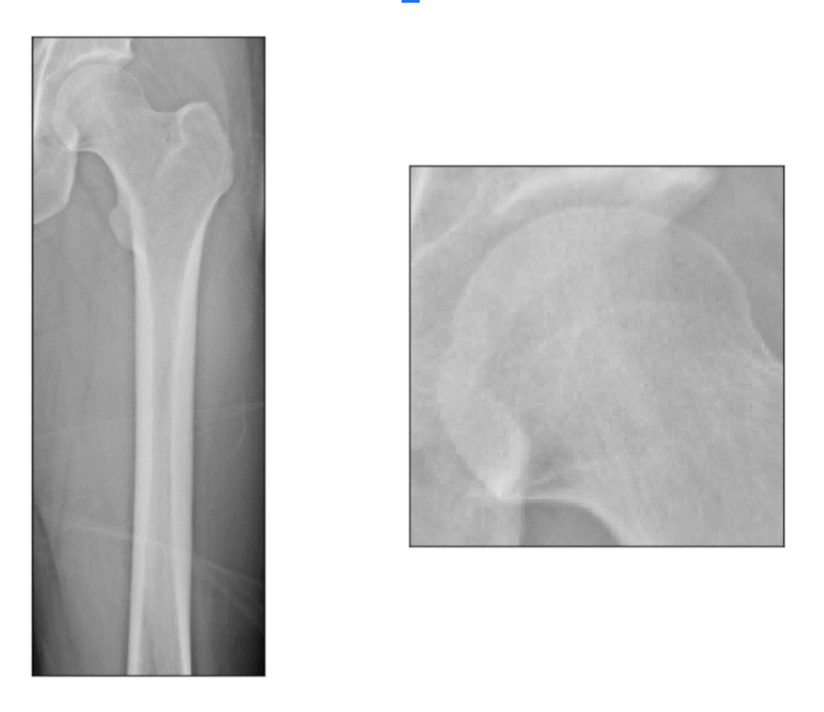

Using the Hough Transform, we isolated the femoral head circle. The parameters for the Hough Transform were set as follows:
- `dp = 2`
- `minDist = 5`
- `param1 = 70`
- `param2 = 35`

The minimum radius for circle detection was set to one-third of the number of columns in the femoral head region, and the maximum radius was set to two-thirds of the number of columns in this region.

  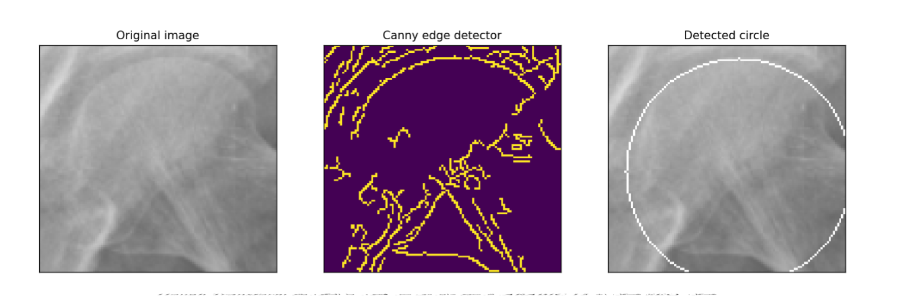

In the next step, we aimed to identify the edge points of the femur shaft. It seemed feasible to locate the left edge by selecting a point in each row that had the maximum intensity difference with the pixel directly to its left (similarly, to locate the right edge, we could select the point with the greatest intensity difference compared to the pixel to its right). However, this approach sometimes yielded undesirable points in certain rows.

To address this, we refined the edge detection method: for the left edge of the shaft, in every tenth row, we initially selected the four pixels with the highest positive intensity difference compared to their neighboring left pixels (brighter than the pixel on their left). Similarly, for the right edge, in every tenth row, we selected the four pixels with the highest negative intensity difference with their left neighbors (darker than the pixel on their left).

  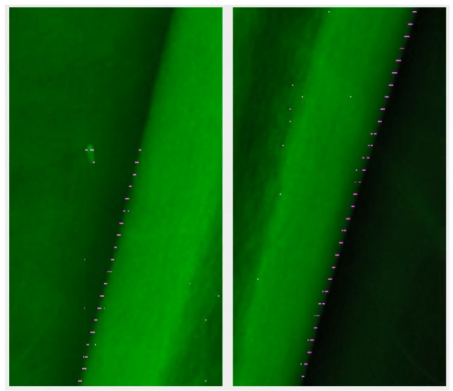

To select the optimal point in each row, we defined an error function.

Using this error function, we first calculated the cumulative error for each of the four points in the first row with respect to all points in the subsequent rows. The point in the first row with the lowest cumulative error was selected as the shaft edge for that row. Then, in each subsequent row, we calculated the error function for each of the four points relative to the chosen point in the preceding row. The point with the minimum error value was selected in each row.

Despite these selections, some undesired points remained among the detected points.

  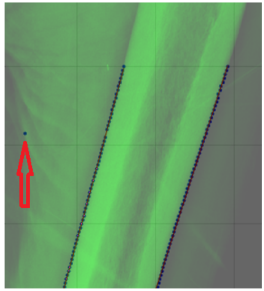

To remove the undesired points, we divided the points into five groups. For each group, we determined a representative point with row and column values equal to the average row and column positions of all points in that group. We then calculated the best-fit line passing through these average points. Since there were far fewer outliers than valid points, this computed line closely approximated the desired final line. We used it as a reference to filter out the outliers: pixels with a horizontal distance from this line exceeding eight times the average distance of all points to the line were identified and removed as outliers. The output of this step is shown in figure below.

The remaining edges were identified using the contour-following algorithm. Before continuing, we will explain this algorithm in detail.

  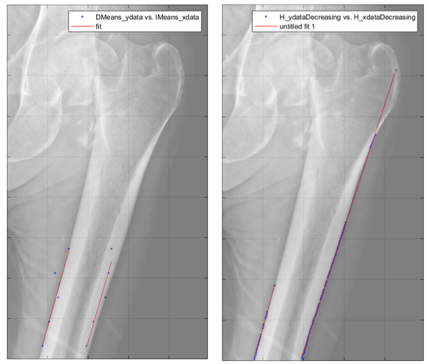

---

**Contour Following:**

The goal of this algorithm is to start with a pixel on the boundary between two regions in an image and then trace that boundary by sequentially selecting other pixels along it.

On the right edge of the femur, given that pixel brightness decreases from high to low near the boundary, we expect to encounter this pattern around the point on the bone’s edge (illustrated as a green pixel in a schematic image).

  <table>
    <tr>
      <td>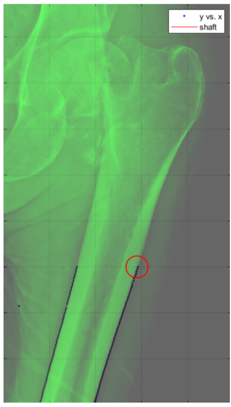</td>
      <td>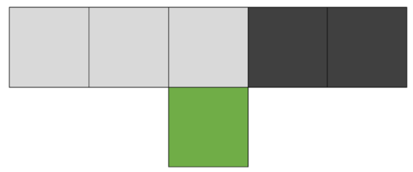</td>
    </tr>
  </table>

In the row adjacent and above the target pixel, the pixel brightness decreases from high to low.

In the contour-following algorithm, to move upward along a vertical (or nearly vertical) edge, we start with a point that we know lies on the edge (the green pixel). In the row directly above this point, we examine a specified number of pixels (specifically, 7 pixels), collectively referred to as the "filter." Among these, the pixel with the greatest brightness difference from its left neighbor is chosen as the next edge point. This selected pixel becomes the new starting point, and we repeat the previous step.

By continuing this algorithm, we can progressively identify the points along the edge.

For movement in other directions, different filters oriented in those directions can be applied.

  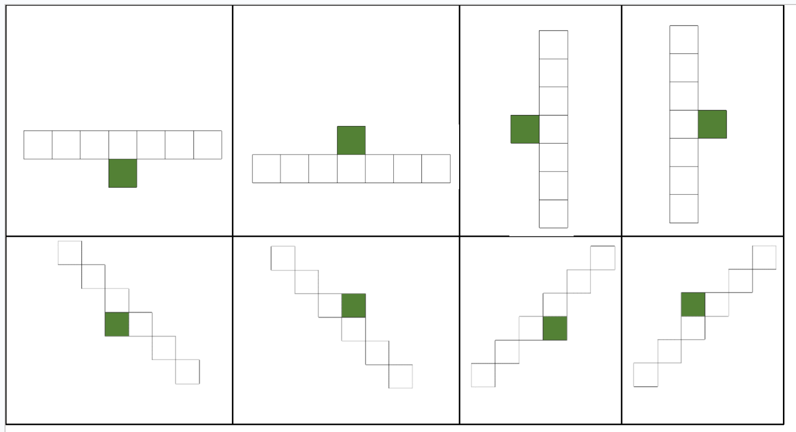

To complete the left and right edges of the femur shaft, a zero-degree filter was applied. For the upper edge of the femur, a vertical filter directed to the right was used.

To find the starting point for the algorithm on the upper edge, we selected a rectangular region adjacent to the femoral head area. The height of this region was 40 pixels less than the femoral head region, while its width was set to 20 pixels.

  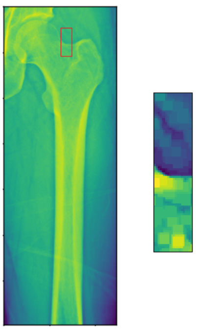

In each column of this region, from left to right, we selected the point with the greatest brightness difference compared to the pixel immediately below it. This allowed us to identify the points in each column that we were confident lay on the femur boundary. This approach is similar to what we initially intended for identifying the femur shaft. However, at that stage, the algorithm failed and generated a lot of noise. In the upper edge of the femur, however, we did not encounter issues with scattered points due to the smaller size of the region and its relatively less cluttered nature.

  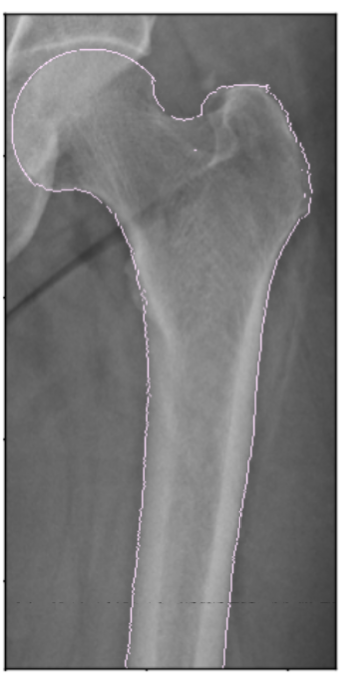

---

**Femur Contour Extraction Using Neural Network:**

For this task, the U-Net model was used again. A total of 583 labeled images were used. 90% of these images were allocated for training, and 10% for evaluating the network's performance. Labeling was done using the quick selection tool in Photoshop.

During the labeling phase, broken bones were excluded from the dataset. This decision was made because the goal of this project was to apply finite element analysis and investigate the potential for healthy bone fractures, to timely replace weak bones with prosthetics. Therefore, broken bones were not relevant to this project.

The labels were provided in TIFF format, and the images were in PNG format. A batch size of 4 was used. The network training was conducted on Google Colab, utilizing the graphics processor provided by Google. After 100 epochs, the network’s accuracy on the test data reached 99.73%. This accuracy was calculated using the **bce_dice_loss** metric, which is the standard for evaluating accuracy in segmentation tasks. The network's output is displayed below.

  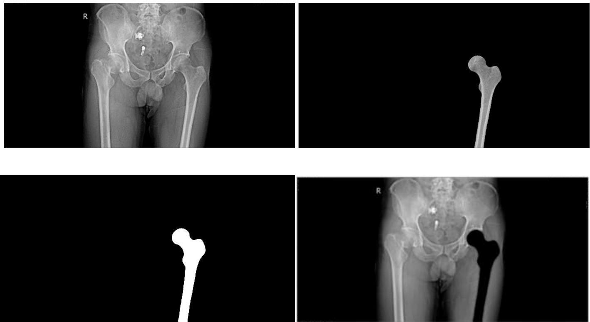

